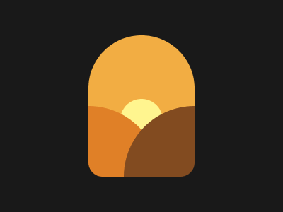

# Target #062 - Sunset

## Objective

<div align="center">



</div>

## Code

```css
<div>
  <div class="left"></div>
  <div class="middle"></div>
  <div class="right"></div>
</div>
<style>
  body {
    display: flex;
    background: #191919;
  }

  body > div {
    position: relative;
    overflow: hidden;

    width: 150px;
    height: 200px;

    display: flex;
    align-items: flex-end;

   	border-radius: 75px 75px 20px 20px;

    background: #F2AD43;
    margin: auto;
  }

  .middle {
    height: 110px;
    background: #FFF58F;
    border-radius: 50px;
  }

  .left, .middle, .right {
    position: absolute;
  }

  .left {
    left: -100px;
    background: #E08027;
  }

  .middle {
    width: 60px;
    left: calc(50% - 30px);
    right: 0;
  }

  .right {
    right: -100px;
    background: #824B20;
  }

  .left, .right {
    z-index: 1;
    position: absolute;

    bottom: -100px;
    border-radius: 50%;

    width: 200px;
    height: 200px;
  }
</style>
```
